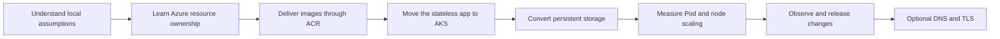

# Learn Azure by migrating this Kubernetes lab

Work through one checkpoint at a time. Start with the existing local lab; the
files under `k8s/azure/` are reference answers to inspect **after** attempting a
conversion yourself. No Azure resources have been created for this plan.

The goal is a practical understanding of the Azure services this project uses,
not a tour of every Azure product. Each stage should take roughly one or two
focused sessions; storage and networking may need more. Use the
[deployment reference](azure-deployment.md) when you want exact commands.



## 0. Explain what already runs locally

Do this before opening Azure. Render `k8s/hpa`, `k8s/load-test`, and
`k8s/jobs/runner`. Trace a battle request from runner or Locust through the
simulator Service to a Ready Pod. Then trace a browser request through the web
proxy to the read-only API and completed artifacts.

Open **Watch replay** and trace browser → API → simulator → verification →
local Showdown player. Compare the first request with a cache hit and inspect
which scripts stay local versus which graphics/audio use the asset host.

Draw the current system yourself. Label who owns the Deployment, the HPA,
the runner Job, and the PVC. Explain why the runner is a singleton and why
Locust and VPA should not compete with the simulator's CPU HPA.

**Checkpoint:** you can explain why `docker build` on your laptop does not make
an image available on a cloud worker, why a ClusterIP is not a public endpoint,
and why a successful Pod restart does not imply its filesystem was retained.

## 1. Learn the Azure ownership model

Learn tenant, subscription, resource group, region, resource provider, RBAC,
and managed identity. Use one dedicated lab resource group. Inspect your account
and available AKS versions and VM sizes before creating compute. Create a budget
alert and identify the resources that will keep costing money between sessions.

Observe the difference between the resource group you choose and the AKS-managed
node resource group. Find where the node VM scale set, disks, networking, and
load balancer live in the portal.

**Checkpoint:** you can name the subscription and region being used, identify
which resources you own versus AKS manages, and explain why a budget notification
does not automatically stop spending. Read [Azure budgets](https://learn.microsoft.com/en-us/azure/cost-management-billing/costs/tutorial-acm-create-budgets).

## 2. Convert image delivery before converting Kubernetes

Build the simulator locally and run its health endpoints. Create ACR, push an
image with the full Git commit SHA, and inspect its digest. Repeat for the web,
API, and Locust images. The API needs repository-root build context because it
uses shared simulator report code; inspect `.dockerignore` to see why historical
evidence is excluded from that context.

Compare these image references:

```text
metronome-simulator:phase10
yourregistry.azurecr.io/metronome-simulator:<full-commit-SHA>
yourregistry.azurecr.io/metronome-simulator@sha256:<digest>
```

**Checkpoint:** you can explain the registry/name/tag/digest parts and why a
moving tag makes a rollout harder to reproduce. Understand ACR push permission
for your account and ACR pull permission for the kubelet identity as separate
capabilities. The starting setup uses [AKS managed identity integration with ACR](https://learn.microsoft.com/en-us/azure/aks/cluster-container-registry-integration).

## 3. Convert the stateless local cluster setup to AKS

Create a small Linux AKS Standard cluster with Azure CNI Overlay. First deploy
only the simulator Service and Deployment through your own overlay. Change the
image reference, keep the same health paths and resource requests, and verify
the selected `kubectl` context. Use port-forwarding to make a battle request.
Then add the HPA. AKS supplies Metrics Server; compare its managed installation
with the local TLS patch rather than installing that patch in AKS.

Build the conversion as successive diffs:

1. Reference the existing base instead of copying the entire Deployment.
2. Replace local image tags with the ACR reference.
3. Change the environment namespace and verify Service DNS within it.
4. Omit fixed `replicas` when HPA owns the simulator count.
5. Check health probes, non-root operation, and request-based scheduling.

**Checkpoint:** render your overlay and predict every resource before applying
it. Verify running image, readiness, HPA metrics, and Service endpoints. Compare
your solution with `k8s/azure/app/kustomization.yaml` only now. That reference
also adds the explorer and its archive PVC; introduce those in the next stage.

## 4. Convert persistence and add the explorer

Start with a committed sample export so you can validate the explorer without
running a tournament. Inspect the local default StorageClass, then compare it
with `managed-csi-premium` and `azurefile-csi` on AKS.

| Need | Local assumption | Azure conversion |
| --- | --- | --- |
| Restart-safe writable runner state | Default filesystem PVC, RWO | Azure Disk CSI, `ReadWriteOncePod` |
| Completed archive served by APIs on different nodes | Local exported directory | Azure Files CSI, RWX PVC mounted read-only by API |
| Nginx scratch files | Writable `/tmp` | Bounded `emptyDir` with read-only root filesystem |

Learn PV versus PVC, StorageClass, CSI, access modes, reclaim policy, disk zone
placement, and volume binding. Explain why RWO means one node, not one writer.
The runner and archive deliberately use different volumes; the API never
mounts writable runner state.

Add the API and web Deployments, copy one **completed** sample into the archive,
and browse via port-forward. Then run a new sample tournament on the disk,
export it after completion, validate it, and publish that export into the archive.
Delete and recreate the API Pod to observe persistence without altering evidence.

Use the same replay dialog after migration. Confirm that the API now reaches
the simulator through Service DNS and that a regenerated replay still agrees
with the saved tournament hash.

**Checkpoint:** explain what survives a Pod restart, which mount permits writes,
and what happens to stored data if you delete a PVC. See [Azure Disk CSI](https://learn.microsoft.com/en-us/azure/aks/create-volume-azure-disk) and [Azure Files CSI](https://learn.microsoft.com/en-us/azure/aks/azure-csi-files-storage-provision).

## 5. Separate Pod scaling from node scaling

Run a small, finite Locust load. Record replicas, RPS, latency, failures,
requested CPU, actual CPU, and Pending events. Keep the same seed, workload,
and image when comparing resource configurations.

First observe HPA with fixed node capacity. Then enable the AKS cluster
autoscaler with a small maximum node count and repeat. It reacts to scheduling
pressure; it does not simply mirror the CPU HPA. A VM size still has to be able
to fit each individual Pod. Recalculate the capacity demo for these nodes rather
than copying the local `6100m` request.

Compare runner concurrency 2, 6, and 10 only after measuring storage latency.
Per-result flushes and checkpoint writes may dominate on cloud disks. Preserve
restart correctness while benchmarking; concurrency alone cannot remove a
serialized persistence cost.

Compare first-time replay requests for different matches with cache hits while
watching simulator CPU and HPA metrics. The API permits two distinct generations
at once, so a few manual clicks may produce no scaling; use the finite Locust
workload for sustained load and explain the difference.

**Checkpoint:** diagnose a Pending Pod from its scheduler event and distinguish
image pull failure, insufficient resources, volume attachment, and unhealthy
readiness. Explain when HPA and cluster autoscaler each act. Read
[AKS cluster autoscaler](https://learn.microsoft.com/en-us/azure/aks/cluster-autoscaler).

## 6. Observe, release, and recover

Start with `kubectl logs`, events, `top`, and rollout status. Introduce Azure
Monitor Container Insights only when you can name a question it should answer,
such as retained restart history or node resource trends. Compare its ingestion
cost with the value of the data you retain.

Follow a commit through tests, immutable image publication, ACR delivery,
overlay rendering, and rollout. Publish a harmless UI change and revert to the
previous image to practice rollback. The repository's shared CI now verifies
all components; manual promotion is a useful learning step. Later, choose one
deployment owner: a deployment workflow or Argo CD. Avoid having both reconcile
the same resources.

**Checkpoint:** prove which commit is running and recover a previous version
without rebuilding it. If you later automate Azure access, learn GitHub OIDC
and scoped Azure roles at that point.

## 7. Optional: external routing, DNS, and TLS

Explain ClusterIP versus LoadBalancer and why browser `/api/` requests go through
the same web origin. Only now enable the AKS Gateway API application routing
implementation, compare `Gateway` with `HTTPRoute`, and map a hostname to the
gateway address. Complete TLS before treating it as a public deployment.

The optional reference uses `approuting-istio`; verify regional and cluster
support using the [current Gateway API documentation](https://learn.microsoft.com/en-us/azure/aks/app-routing-gateway-api). It creates extra managed gateway workloads and a load balancer, so inspect the added resources and cost.

**Checkpoint:** trace browser → gateway → web → API → archive, verify TLS and
same-origin requests, and confirm that simulator and Locust remain internal.

## 8. Optional: use the replay dialog to learn asset delivery

Keep the in-page replay dialog as the permanent interface. First trace its local
browser → API → simulator → verification → player path using
[the replay guide](battle-replays.md). Repeat the same path after converting your
local setup to AKS. Observe the simulator's CPU and HPA for first-time replay
requests, and compare them with repeated requests served from the temporary cache.

Use the existing web/API services to practice Gateway API host/path routing;
frontend page routing and Kubernetes traffic routing are separate concepts.
No extra replay page or publicly exposed simulator is needed for this exercise.

Later, study Azure Blob Storage by hosting graphics/audio under the same
`sprites/`, `fx/`, and `audio/` directory structure. Check artwork credits and
redistribution terms before uploading the assets. Set
`VITE_SHOWDOWN_ASSET_BASE_URL` for the web build and inspect the browser requests.
Explore cache headers and a CDN only after direct Blob delivery works.

**Checkpoint:** verify a replay still matches its recorded hash, explain which
requests hit AKS versus the asset host, and distinguish browser, CDN, and API log
caches. No application secrets or replay database are required.

## Finish each session deliberately

Record one thing learned, one observed result, and the next unanswered question.
Export artifacts you want to keep. Stop the lab cluster between sessions if
appropriate, and inspect remaining ACR, disk, share, and networking charges;
stopping nodes is not deleting all billable resources. See [AKS stop/start](https://learn.microsoft.com/en-us/azure/aks/start-stop-cluster).

When finished with the lab, inspect and delete its dedicated resource group
after preserving required data. Avoid turning a temporary experiment into a
permanent cloud bill.

Defer Key Vault, application credentials, databases, service mesh, multi-region
design, and enterprise policy until the application has a concrete need for
them. The present app can teach registry permissions and managed identity
without inventing an application secret.
