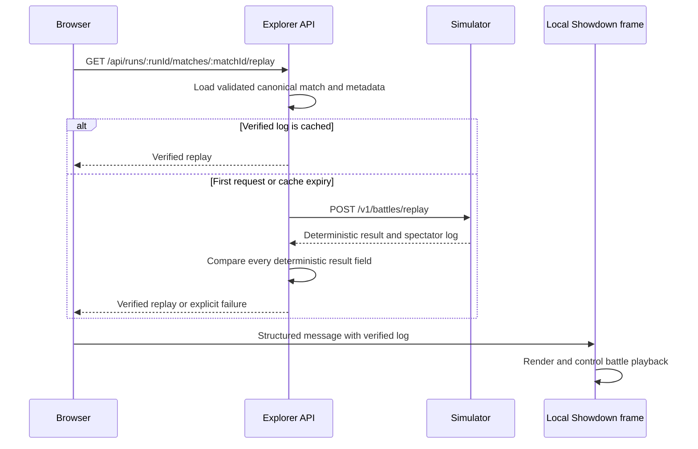

# Verified battle replays

In the online report, expand **Battle explorer**, select a battle, and click
**Watch replay**. The permanent interface is an in-page dialog. It starts paused
and muted, with play/pause, reset, previous/next turn, turn selection, speed,
switch-side, and sound controls. Escape closes it, including from inside the
player. The downloadable offline report remains self-contained.

## Run locally

Use Node 24.20.0. Install simulator and frontend dependencies with
`npm ci --ignore-scripts` in their respective directories. From the repository
root, start each service in its own terminal:

```sh
node simulator/src/server.js
```

```sh
TOURNAMENT_STATE_ROOT="$PWD/evidence/tournaments" \
SIMULATOR_BASE_URL=http://127.0.0.1:3000 node explorer-api/src/server.js
```

```sh
npm --prefix explorer-web run dev
```

Open `http://localhost:5173/runs/sample-32-002`. Frontend development proxies
`/api` to port 3001; the API delegates replay generation to port 3000. The archive
root must contain a `runs` directory. For a different archive, use an absolute
`TOURNAMENT_STATE_ROOT`. All canonical artifacts remain read-only.

## Regenerate, verify, display



Supported rules are `metronome-singles-v1`, with `pokemon-showdown@0.11.11` and
the existing 100-turn cap, teams, seed, and choices. Normal simulations do not
capture logs. The original raw protocol hash still excludes timestamp lines;
spectator extraction is a separate operation and never changes that hash.

Verification includes match identity, participants, seed, engine version, winner,
outcome, turns, termination, and protocol hash. Hostname and wall-clock duration
are operational observations and are not compared. Mismatches return
`409 REPLAY_MISMATCH` with no playable log; unsupported versions return
`422 REPLAY_UNSUPPORTED`. Temporary failure, busy, and timeout responses offer a
retry. Logs are never uploaded to the public Showdown replay service.

Each API process has a five-minute LRU cache, capped at 100 entries and 16 MiB.
Its key fingerprints current canonical inputs and expected results. Identical
pending requests share work; at most two different generations run concurrently
per API process. Generation times out after 30 seconds and logs are capped at
1 MiB. Only verified successes enter the cache. Closing a pending dialog aborts
the browser request; shared server-side regeneration can finish and populate the
cache. No database or writable replay volume is needed.

Structured logs identify cache hits, generation duration, mismatching fields,
and upstream failures, without printing battle protocols.

## Pinned viewer and assets

The frontend vendors the battle/replay subset at client commit
`c0f6bfc707a5e3bba4da3785e9cb06c8ae04f8d9`. Simulator data and the MIT formatter
are frozen from `pokemon-showdown@0.11.11`; sprite dimensions are a separately
hashed snapshot from the asset host. `vendor/showdown/manifest.json` records
every source checksum. `npm run build:showdown` verifies inputs and rebuilds the
isolated classic-script engine; frontend development and production builds run
it automatically without network downloads. The data adapter converts the old
simulator's text placeholders to the pinned client's syntax without modifying
battle inputs or logs.

JavaScript, supporting data, and styles are served locally. Graphics and audio
are fetched from the HTTPS asset base, initially `https://play.pokemonshowdown.com/`.
Set `VITE_SHOWDOWN_ASSET_BASE_URL` when building to change that base; it must be an
HTTPS directory URL without credentials, query, or fragment. Preserve the host's
`sprites/`, `fx/`, and `audio/` paths when migrating assets later.

For the production image, pass
`--build-arg VITE_SHOWDOWN_ASSET_BASE_URL=https://your-host.example/assets/`
to `docker build -f explorer-web/Dockerfile explorer-web`. This is a build-time
frontend setting; changing it requires rebuilding the web image.

The frame accepts structured messages only from its same-origin parent with the
matching replay identity. It cannot submit forms, navigate the parent, or load
remote executable scripts. Only `/showdown/player.html` permits same-origin
framing; the rest of the production frontend retains `X-Frame-Options: DENY`.
Missing player assets show an error or warning with a readable verified log.

Upstream distinguishes the MIT battle engine from the full AGPLv3 client, and
styles/artwork have separate terms. Original source, headers, full license texts,
build code, and dependency lock are served alongside the viewer. See
`explorer-web/vendor/showdown/NOTICES.md` for provenance and credits.

## Validation

Run simulator and API tests, frontend tests, and the production frontend build.
Coverage includes unchanged golden hashes, tie/end parsing, turn caps, split
channel extraction, unsupported versions, every deterministic-field mismatch,
cache expiry/eviction/invalidation, coalescing, concurrency, timeout, and limits.

The maintained browser smoke check exercises a real sample through Nginx: all controls,
commentary, frame Escape, focus restoration, narrow screens, production framing
headers, missing asset 404s, and remote requests limited to images/audio. It uses
`sample-32-002`, with a simulator and explorer API serving that completed run.
With those services running and Nginx serving the built web app on port 8080:

```sh
cd explorer-web
npx playwright install chromium
npm run check:replays
```

Use `REPLAY_CHECK_URL` for a different production origin, or
`REPLAY_CHECK_BROWSER=msedge` / `chrome` for an installed browser channel.
Screenshots are written to the ignored `.validation` directory. This check
requires HTTPS access to the configured graphics/audio host.

For Kubernetes, the API uses `SIMULATOR_BASE_URL=http://metronome-simulator`.
The Azure reference overlay supplies this environment value and keeps archive
mounts read-only. No Azure resources are provisioned by this feature.
