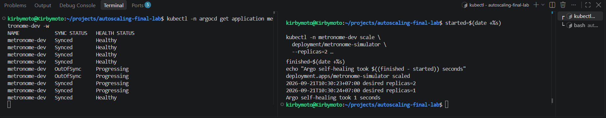

# Lab 1: GitOps

## Drift correction

**Date:** 2026-09-21  
**Environment:** Docker Desktop Kubernetes, `metronome-dev` namespace  
**Application:** `metronome-dev`

### Objective

Verify that Argo CD detects and corrects a manual change to a resource managed from Git.

The dev overlay declares one simulator replica:

```yaml
spec:
  replicas: 1
```

The Argo CD Application has automated synchronization and self-healing enabled:

```yaml
syncPolicy:
  automated:
    enabled: true
    prune: true
    selfHeal: true
```

### Procedure

The live Deployment was manually scaled from one replica to two without changing Git:

```sh
kubectl -n metronome-dev scale \
  deployment/metronome-simulator \
  --replicas=2
```

The Deployment replica specification and Argo CD Application status were observed until reconciliation completed.

### Observations

Argo CD reported the following status sequence:

```text
Synced / Healthy
OutOfSync / Progressing
Synced / Progressing
Synced / Healthy
```

The live Deployment specification changed as follows:

```text
2026-09-21T10:30:23+07:00 desired replicas=2
2026-09-21T10:30:24+07:00 desired replicas=1
```

Argo CD restored the Git-declared replica count in approximately **one second**.

### Interpretation

The manual scale operation changed only the live cluster. Git still declared one replica, so Argo CD identified the Deployment as `OutOfSync`. Because self-healing was enabled, Argo reapplied the desired state and restored `spec.replicas` to one.

The Application briefly remained `Progressing` after returning to `Synced` while Kubernetes completed the replica transition. It returned to `Healthy` after the Deployment stabilized.

The correction interval is influenced by Kubernetes event detection, the Argo CD application controller’s reconciliation behavior, and its self-heal timeout and retry settings. This installation has no explicit self-heal timing override.

### Measurement limitation

The timing script sampled once per second and used whole-second timestamps. The recorded one-second result is therefore an approximate measurement of how quickly the Deployment specification returned to one. It does not independently measure the later transition from `Progressing` to `Healthy`.

### Result

**Passed.** Argo CD detected live configuration drift and automatically restored the state declared in Git.



## Git rollback and recovery

### Objective

Verify that a broken desired state committed to Git is deployed by Argo CD and that reverting the Git change restores the last working configuration.

### Procedure

The dev overlay image tag was changed from the valid `phase10` image to the nonexistent `huh-it-doesnt-exist` tag. The change was merged into `main`, which is the branch watched by the `metronome-dev` Argo CD Application.

### Failure observation

Argo CD reconciled Git revision `70c88df64247e9029a1cfef73c41f2da4d3d5b69`. The Application became `Synced` because the live Deployment matched the broken state in Git, but its health remained `Progressing`.

Kubernetes created a new ReplicaSet using:

```text
metronome-simulator:huh-it-doesnt-exist
```

The new Pod repeatedly entered `ErrImagePull` and `ImagePullBackOff`. Kubernetes retained the previous healthy `phase10` Pod because the Deployment used a rolling-update strategy.

This demonstrates that `Synced` means the cluster matches Git; it does not guarantee that the workload is operational.

### Rollback

The broken Git change was reverted and merged through pull request #3. Argo CD reconciled revert revision `703e7ab22e5ae6fdb70d4a6d2db3914f6009ca3b`.

After reconciliation:

- The Deployment again referenced `metronome-simulator:phase10`.
- The valid ReplicaSet had one ready replica.
- The broken ReplicaSet was scaled to zero.
- The Application returned to `Synced / Healthy`.

### Result

**Passed.** Reverting the broken Git change restored the last valid application state without manually modifying the Deployment or manually synchronizing Argo CD.
