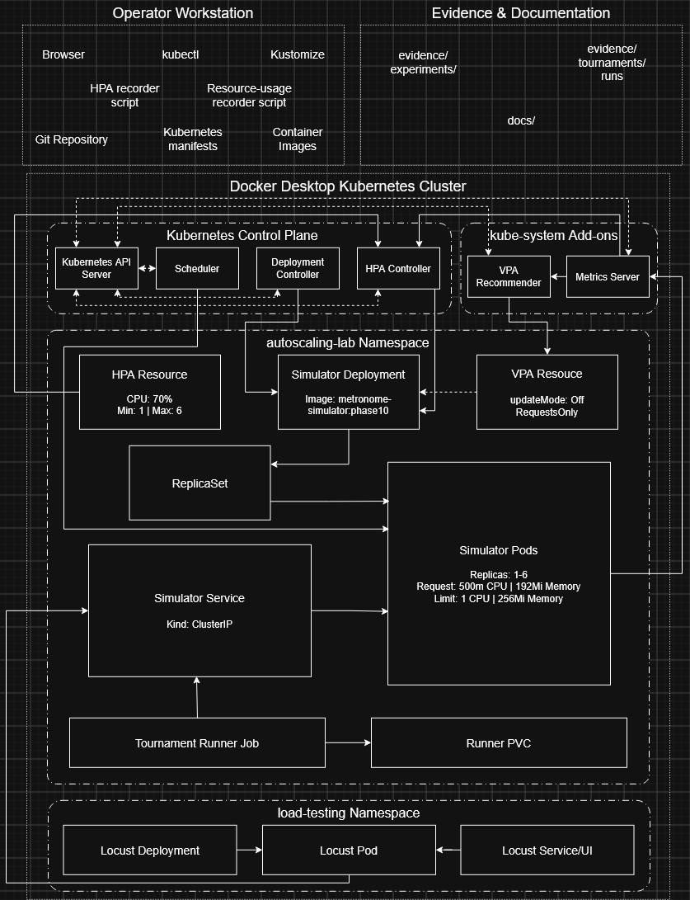

# Metronome Tournament Autoscaling Lab — Technical Design

Status: implemented and validated, updated 2026-09-24.
The full tournament, resource-assisted recovery, and final audit package are
complete.

## Environment

The lab runs on a Docker Desktop kind cluster with Kubernetes `v1.36.1`. The cluster has four nodes: three schedulable workers and one control-plane node protected by a `NoSchedule` taint. The default local-path StorageClass uses `WaitForFirstConsumer` volume binding.

Metrics Server is installed and working. Test traffic stays inside the cluster, so the accepted test path has no current Traefik dependency.

## Decision summary

The system consists of:

- one stateless simulator Deployment;
- one singleton tournament-runner Job;
- one fixed-replica Locust Deployment in the `load-testing` namespace;
- one ClusterIP Service used by both the runner and Locust;
- one PVC for runner results and checkpoints; and
- a report command that generates a self-contained offline HTML report.

Only the simulator Deployment is an HPA target. The runner is a single coordinator, and Locust keeps a fixed replica count. The core lab system does not require a database, message queue, or external Pokémon Showdown server.

The accepted HPA uses a 70% CPU-utilization target against the simulator's
`500m` request, one minimum replica, six maximum replicas, no scale-up
stabilization, and a 150-second scale-down stabilization window. The canonical
[Phase 7 record](phase7-hpa-autoscaling.md) contains the acceptance evidence
and limitations.

The accepted VPA `v1.7.1` comparison uses `updateMode: "Off"` and
`controlledValues: RequestsOnly` for CPU and memory. Its settled `511m` CPU
target is 11m (2.2%) above the manual `500m` request, independently supporting
that choice without changing it. The canonical [Phase 8 record](phase8-vpa-autoscaling.md)
contains the evidence, memory-floor caveat, and limitations.

A read-only Pokémon Showdown replay viewer is an optional personal-interest extension after the 32-species sample tournament is complete. It does not change the lab acceptance criteria or autoscaling boundary, and it must not delay the runner, restart/resume, report, resource-sizing, HPA, VPA, or capacity evidence.

The simulator pins `pokemon-showdown` to exact version `0.11.11` and commits `package-lock.json`. Contract tests protect the application from unexpected assumptions about the pinned simulator interface and data.

## Verified implementation

The following implementation is complete and verified:

- `pokemon-showdown@0.11.11` is pinned with a committed lockfile;
- the battle module uses explicit teams and four-number seeds to produce deterministic results;
- catalog tests enforce the 1,025-base-species roster and 581 Metronome-callable-move contracts;
- battles apply a deterministic completed-turn cap rather than treating a wall-clock timeout as a draw;
- the HTTP service validates requests and returns deterministic battle results;
- automated catalog, battle, turn-cap, validation, and HTTP endpoint tests pass;
- the simulator container runs as a non-root user;
- Kubernetes manifests define the simulator Deployment and ClusterIP Service;
- Metrics Server is installed and supplies node and Pod resource metrics;
- Locust runs as an in-cluster workload; and
- one-replica and three-replica exploratory experiments have been completed;
- Phase 6 fixed-replica resource sizing selected a `500m` CPU request, `1` CPU
  limit, `192Mi` memory request, and `256Mi` memory limit;
- Phase 8 compared the manual requests with a recommendation-only VPA; the
  settled `511m` CPU target supported the selected `500m` request and no
  resources were changed;
- the singleton tournament-runner Job and its `npm run runner` command override
  are implemented; and
- the 32-species restart/resume validation completed successfully with a
  deliberate runner Pod replacement, preserved Job and PVC, and completed run;
- sample run `sample-32-001` completed with 144 accepted results, 144 unique
  match IDs, and Rayquaza as champion; and
- its self-contained `report.html` was generated and opened locally through
  `file://`, confirming the required offline report path.

The implemented request and response shapes are documented in the [Simulator API Contract](api-contract.md). The exploratory results and evidence links are recorded in the [single-Pod baseline](baseline-experiment.md) and [three-Pod experiment](three-pod-experiment.md).

### Pokémon Showdown integration rationale

The simulator uses the raw `BattleStream` interface because it exposes the complete simulator protocol, including the final `end` record needed to collect the winner, turn count, seed, and replay metadata. The application sends `>start`, `>player`, and deterministic player-choice commands, then parses that terminal record. The upstream [simulator documentation](https://github.com/smogon/pokemon-showdown/blob/master/sim/SIMULATOR.md), [simulator exports](https://github.com/smogon/pokemon-showdown/blob/master/sim/index.ts), and [battle end implementation](https://github.com/smogon/pokemon-showdown/blob/master/sim/battle.ts) document this interface and result path.

`getPlayerStreams()` is not used as the result collector because its routing implementation intentionally omits the `end` message from the player streams. It is useful as a request-routing reference, but would hide the authoritative terminal record required by this workflow; see the upstream [battle stream implementation](https://github.com/smogon/pokemon-showdown/blob/master/sim/battle-stream.ts).

The application supplies fixed teams and selects Metronome, but does not choose the move called by Metronome or reimplement battle rules. Pokémon Showdown selects the called move and resolves the mechanics using the pinned engine and data. The upstream [Metronome implementation](https://github.com/smogon/pokemon-showdown/blob/master/data/moves.ts) is also the basis for the 581-callable-move contract test.

## Architecture and workload ownership



This diagram covers the core autoscaling and tournament system. The separate
GitOps extension deploys dev and prod Kustomize overlays through Argo CD; those
extension environments and the CI image-publishing workflow are intentionally
outside the diagram's boundary.

The diagram separates five kinds of relationship. Dotted bidirectional lines
represent components reading and writing Kubernetes state through the API
Server. Solid control or ownership lines represent reconciliation, scaling,
or the creation and removal of subordinate resources. Service-to-Pod and
client-to-Service lines represent request routing rather than ownership. The
dashed VPA target line represents observation and recommendation without
mutation. The runner-to-PVC line represents a mounted storage dependency.
Line direction describes the architectural effect and is not intended as a
packet-level protocol trace.

### Deployment and request path

The simulator Deployment manages its ReplicaSet, and the ReplicaSet maintains
the desired simulator Pod count. The ClusterIP Service does not own those
Pods: it selects Ready endpoints by label and provides a stable DNS name for
clients. Locust sends `POST /v1/battles` load through that Service, and the
tournament runner uses the same Service for deterministic tournament work.
The runner separately mounts the PVC for immutable results, restart-safe
checkpoints, derived standings, bracket state, and reports.

Locust is a fixed-replica Deployment in the separate `load-testing` namespace.
Its Service exposes the web UI, which the operator reaches through a local
port-forward. This separation prevents the load generator from becoming part
of the HPA target while still accounting for its resource requests in cluster
capacity calculations.

### Horizontal autoscaling control loop

Simulator CPU and memory measurements originate at the Pods and are collected
through the kubelets by Metrics Server. Metrics Server publishes
`metrics.k8s.io` through the aggregated Kubernetes API. The HPA controller
combines the observed CPU utilization with the policy stored in the HPA
resource: a 70% CPU target, one minimum replica, six maximum replicas, no
scale-up stabilization, and a 150-second scale-down stabilization window.

When a change is required, the HPA controller writes the simulator
Deployment's scale subresource through the API Server. The HPA does not create
Pods directly. The Deployment controller reconciles the new desired replica
count, the ReplicaSet creates or removes Pods, and the Scheduler assigns new
Pods to eligible nodes. The resulting Pod measurements close the feedback
loop.

### Vertical recommendation loop

The VPA recommender reads workload state and usage history through Kubernetes
APIs and writes its calculated CPU and memory recommendation into the VPA
resource's status. The VPA resource's `targetRef` identifies the simulator
Deployment, but `updateMode: "Off"` means no recommendation is applied and no
Pod is evicted or restarted. `controlledValues: RequestsOnly` records that the
comparison concerns requests rather than limits. VPA therefore acts as a
sizing advisor and does not become a second actuator competing with the
CPU-utilization HPA.

### Kubernetes control and evidence boundaries

The API Server is the coordination point for the Scheduler, Deployment
controller, HPA controller, Metrics Server, and VPA recommender. For example,
the Scheduler watches for unscheduled Pods and writes node bindings back
through the API Server; it is not directly invoked by the Deployment or HPA.

The workstation and evidence areas are operational boundaries rather than
in-cluster workloads. Git stores the manifests, Kustomize renders the selected
overlays, and `kubectl` applies them through the API Server. The HPA and
resource-usage recorder scripts also query the API through `kubectl`; they do
not start Locust or modify the autoscaling configuration. Their observations
are written to unique directories beneath `evidence/experiments/`, while
tournament artifacts are retained beneath `evidence/tournaments/runs/` and
the analysis is maintained in `docs/`.

Only simulator Pods autoscale. The HPA uses the simulator Deployment as its `scaleTargetRef`; Locust labels and selectors are separate and are excluded from the HPA target.

The singleton runner generates a deterministic schedule and uses a bounded HTTP
worker pool. Its PVC uses `ReadWriteOnce`, a single-node attachment mode rather
than a single-Pod writer guarantee, and retains multiple historical runs under
`<stateRoot>/runs/<runId>/`. Writer exclusivity comes from operating one
singleton runner Job at a time; the runner does not coordinate multiple
writers. Metadata, roster, results, checkpoint, standings, bracket, and
failure-diagnostic artifacts are isolated per run directory. Before its first
battle request, a new run atomically creates an immutable `roster.json`
containing the exact selected and shuffled entrant order. On restart, the
runner verifies the directory's immutable identity, loads and validates that
persisted roster instead of rebuilding it from mutable configuration, reloads
its checkpoint and results, ignores completed match IDs, and safely resends
only missing work. A missing, corrupt, or conflicting established roster stops
recovery without overwriting evidence. Because each match ID determines its inputs and seed, a duplicate with identical deterministic fields is deduplicated and accepted only once. A duplicate whose deterministic fields conflict is treated as a reproducibility failure: recovery stops and the established evidence is left unchanged.

The runner and Locust resolve the simulator Service through Kubernetes DNS. A Service routes connections across Ready endpoints but does not guarantee strict request-by-request round robin; clients use enough independent connections, and the returned `servedBy` value is used to verify distribution.

The runner remains a singleton because it owns the authoritative checkpoint. Group matches can use its worker pool concurrently. Knockout rounds are barriers: series within one round can run concurrently, but the runner waits for all winners before constructing the next round.

## Tournament rules

### Roster and grouping

- Read the roster from `Dex.mod('gen9').species.all()` in the pinned package.
- Include entries with National Dex numbers 1 through 1,025 where `name === baseSpecies`.
- Assert both roster length and unique National Dex number count are 1,025.
- Sort by National Dex number before shuffling.
- Derive the roster seed from `SHA-256(UTF8(tournamentSeed + "\nroster"))`, interpreting the first eight digest bytes as four unsigned 16-bit big-endian integers.
- Shuffle using the pinned Showdown `PRNG.shuffle`, and save the complete ordered roster as evidence.
- Divide the shuffled full roster, in order, into groups of 257, 256, 256, and 256.

### Battle set

- Format: `gen9customgame`, allowing the synthetic set without claiming that every species can legally learn Metronome.
- One Pokémon per side at level 100.
- IVs: 31 in all six stats.
- EVs: 0 in all six stats.
- Nature: Serious, which is neutral.
- Item: none.
- Move list: Metronome only.
- Ability: the species' primary ability, `species.abilities[0]`.
- Gender: use a species' fixed M/F/N gender; use M for a variable gender ratio.
- Happiness: 255.
- Never select Terastallization.
- Pokémon Showdown chooses the Metronome-called move and resolves the battle mechanics.

### Seeds and side assignment

Every simulation has a unique stable `matchId`, such as `group-A-000001` or `r64-series-03-game-02`. Its Showdown seed is derived as follows:

```text
digest = SHA-256(UTF8(tournamentSeed + "\n" + matchId))
seed = [u16be(digest[0:2]), u16be(digest[2:4]),
        u16be(digest[4:6]), u16be(digest[6:8])]
```

Record the tournament seed, `matchId`, four-number Showdown seed, exact package version, rule version, teams, and choices. A seed alone is not sufficient for reproducibility.

For a group match, use the next digest bit to select the p1 participant. In knockout series, alternate p1 between games. This makes side assignment deterministic and balanced.

Every accepted knockout simulation is called a game. Its stable `matchId`
uses a two-digit game suffix, such as `r64-series-03-game-02`. Operational
retries reuse that game ID, participants, and seed; retry numbers belong only
in runner logs or metadata and never become part of `matchId`. A draw consumes
the current game and the next game uses its next game ID and derived seed.

### Completion, draws, and errors

- After 100 completed turns, force a tie before accepting choices for a further turn.
- A natural Showdown tie is also a draw.
- An application timeout, stream exception, invalid response, or HTTP failure is an operational error rather than a draw. Retry the same `matchId` and seed up to three times with exponential backoff, then fail the tournament.
- Successful records in `results.jsonl` retain their complete request identity and deterministic output fields. Do not write a redundant sampled-success input file.
- After a request exhausts the existing retry policy, append a reproduction-oriented record to non-authoritative `failures.jsonl` before marking the run failed when storage permits. It contains run, match, stage and round context, the request input, timestamp, and normalized error/status details. It is never accepted as tournament progress.

### Full group stage

For a group of `n`, generate each unordered pair `i < j` exactly once:

- group A: `257 × 256 / 2 = 32,896` battles;
- each other group: `256 × 255 / 2 = 32,640` battles; and
- total: **130,816 group-stage battles**.

Scoring is win = 3 points, draw = 1 point for each participant, and loss = 0. Rank participants by:

1. total points;
2. mini-table points from matches among the tied cohort;
3. total wins;
4. Sonneborn–Berger score, stored as an integer: twice each defeated opponent's final points plus each drawn opponent's final points; and
5. ascending deterministic tie key `SHA-256(tournamentSeed + "\nrank\n" + group + "\n" + speciesId)`.

Save every intermediate tie-break value in the standings output. The top 16 participants from each group advance.

During group play, standings are provisional calculations derived from the currently accepted results. The runner atomically replaces `standings.json` after each absolute multiple of 10 accepted group results in sample mode or 1,000 in full mode so progress is observable without making the snapshot authoritative. Recovery at a cadence boundary safely rewrites the derived snapshot before assigning more work. Snapshot generation and atomic replacement occur in the runner's serialized persistence path. This may briefly pause further request assignment at a cadence boundary, but it does not create group-stage round barriers; already-started independent matches may still complete. A group standing is final only after every unordered pair has one accepted result, and only that complete final standing may be used to select advancing participants.

### Full knockout stage

- The round of 64 pairs A with B and C with D. Rank `r` faces rank `17-r` from the paired group, and adjacent series alternate which group supplies the higher seed.
- The fixed round progression is `r64` → `r32` → `r16` → `r8` → `r4`
  → `r2`; `r2` is the final series.
- After each round, adjacent series winners advance together through the fixed
  recorded bracket: the odd-positioned prior series supplies `entrant1`, and
  the even-positioned prior series supplies `entrant2`.
- Regenerate consecutive positions and round-prefixed series IDs for the next
  round. Do not reshuffle or reseed the winners.
- Each advanced entrant retains its original group-stage identity and records
  the immediately preceding series ID as `sourceSeriesId`.
- A series is first to two decisive wins. Draws do not count as wins and consume the next simulation seed.
- Cap a series at seven total simulations. If neither participant has two wins, advance the participant with more decisive wins; if still tied, use and record a deterministic hash lottery.

The game-cap lottery digest is derived without mutable random state:

```text
lotteryHash =
  SHA-256(UTF8(tournamentSeed + "\n" + seriesId + "-lottery"))
```

Record the complete lowercase 64-character hexadecimal digest. The most
significant bit of its first byte selects the winner: bit 0 selects
`entrant1`, and bit 1 selects `entrant2`.

The completed winner of `r2-series-01` is the tournament champion. Champion
selection is derived from the accepted final games, and its summary retains
the original group and rank, immediate source-series provenance, final
resolution and counts, plus `lotteryHash` when a lottery was required.

The full knockout has 63 series and 126–441 simulations. The complete tournament therefore contains 130,942–131,257 simulations.

### Accepted 32-species sample mode

The runner first supports a fixed, curated roster of 32 species defined in configuration and is not selected from the shuffled full roster. It advances the top four participants from each group and uses a fixed 16-entry knockout bracket.

The sample contains 112 group-stage battles and 15 knockout series. At two to seven simulations per series, it requires approximately 142–217 simulations overall. It uses the same seed derivation, side assignment, scoring, tie-breakers, battle rules, retry rules, and result format as the full tournament.

This mode validates the complete runner, checkpoint, standings, bracket, and reporting pipeline. It does not replace the required 1,025-species tournament.

The accepted Phase 5 run, `sample-32-001`, completed with 144 accepted
simulation results and 144 unique match IDs. Rayquaza won the final series and
is the recorded sample champion. The derived self-contained `report.html` was
generated from the completed artifacts and opened locally through `file://`
without network resources.


## Application and API boundary

The service owns the fixed battle rules. Clients provide two valid base species, a `matchId`, and a four-number seed; they cannot submit arbitrary teams, moves, abilities, or formats.

Implemented endpoints are:

- `POST /v1/battles` — validate and simulate one battle;
- `GET /health/live` — confirm that the HTTP process is alive; and
- `GET /health/ready` — confirm that the pinned Dex is loaded and the species and move-count contracts pass.

The API uses camelCase field names. The intended final battle response contains:

- `matchId`;
- `pokemon1` and `pokemon2`;
- `outcome`;
- `winnerSide`;
- `winnerSpecies`;
- `turns`;
- `termination`;
- `seed`;
- `simulatorVersion`;
- `protocolHash`;
- `servedBy`; and
- `durationMs`.

## Results, experiment evidence, and report interface

The runner owns tournament execution state and writes these machine-readable artifacts beneath the selected `<stateRoot>/runs/<runId>/` directory on the PVC. Other per-run directories are retained as historical evidence and are not touched by the active singleton runner:

- `run-metadata.json`: seed, rule version, dependency and image versions, timestamps, and completion state;
- `roster.json`: immutable run identity, normalized roster seed, and the exact final entrant order used after selection and deterministic shuffle;
- `results.jsonl`: one immutable record per accepted simulation;
- `failures.jsonl`: optional append-only diagnostics for requests that exhausted all retries; never authoritative for completion or progress;
- `checkpoint.json`: atomically replaced progress hint whose final `complete`
  state is required by report validation but never overrides `results.jsonl`;
- `standings.json`: atomically replaced provisional or final group scores and
  every tie-break value;
- `bracket.json`: bracket positions, accepted series games, and winners. It
  includes accepted draws but excludes failed HTTP attempts. Each accepted
  game retains its game number, match ID, participants, seed, outcome and
  winner, turns, termination, and protocol hash.

The separate [resource-capture script](../scripts/capture-resource-usage.sh), not the runner, owns experiment observations. For each never-before-used experiment directory, it records immutable metadata, simulator and Locust resources, simulator replica and per-Pod health data, cumulative per-container CPU-throttling counters when the runtime exposes them, and explicit per-sample and final capture status. Acceptance capture starts only from a clean Git worktree and settled one-replica Deployments, records their actual runtime image IDs, and succeeds only if their identities, complete specs, runtime images, settled status, and no-HPA assumption still match at the end. The Locust Pod UID, container ID, and restart count must also remain unchanged because replacement or restart loses its in-memory run state; simulator restarts remain measured evidence. Each measurement has its own collection timestamp; sample start/end and fixed scheduled deadlines expose collection drift without adding collection time to each interval. After the last scheduled sample, capture waits until its nominal duration ends before final validation. Throttling counters reset when a container restarts, so analysis calculates deltas only within one recorded container ID. Phase 7 uses its focused HPA recorder. The legacy `autoscaling-timeline.csv` remains a compatible generic experiment input but is derived rather than authoritative evidence. These observations are collected only during dedicated sizing or Locust/HPA runs and are not ingested by the canonical tournament report. A normal tournament run does not implicitly run a load experiment.

For a Locust run, its per-run HTML report is sufficient evidence when it
contains request totals, RPS, failures, latency percentiles, user history, and
timestamps. CSV exports are optional supporting evidence. Missing CSV files
must not be reconstructed from HTML and represented as original exports. The
Phase 6 two-user directory has a known identity exception: its metadata and
capture status incorrectly contain `phase6-1-user-001`, while the directory
and Locust report show that two users ran. The original evidence remains
unchanged. See the [Phase 6 resource-sizing record](phase6-resource-sizing.md).

The report generator validates the canonical completed tournament artifacts
and produces a self-contained `report.html` with embedded data, CSS, and
JavaScript. It does not ingest restart, recovery, or autoscaling experiments.
It works offline after being copied into the repository and has no CDN
dependency. Regeneration from identical inputs produces substantively
identical content apart from an explicitly labelled generation timestamp.

The implemented generator is invoked from `simulator/` with `npm run report`.
`TOURNAMENT_STATE_ROOT` and `TOURNAMENT_RUN_ID` are required and select
`<stateRoot>/runs/<runId>/`. The default output is
`<stateRoot>/runs/<runId>/report.html`. Before writing, the generator validates
the completed metadata, immutable roster and hash, authoritative result set,
final checkpoint, recomputed standings, deterministic bracket progression,
every knockout game, and champion. Missing, malformed, incomplete, unknown, or
identity-conflicting core evidence stops generation. The HTML is written to a
same-directory temporary file and atomically renamed, so regeneration may
safely replace an earlier report without exposing a partial file.

The battle explorer keeps the full accepted result set in escaped,
column-oriented embedded JSON but renders only the selected page. Search,
filters, sorting, and pagination run locally. The battle explorer and group
standings default to 25 rows and offer 25-, 50-, and 100-row pages. Group
standings use artifact-derived tabs, while knockout round tabs and their
series/game counts are derived from `bracket.json`.

The report also aggregates accepted results by the reported `servedBy`
hostname, with dynamic stage counts discovered from the normalized result
data. When multiple hostnames share a useful prefix, the report derives that
prefix from the observed collection, de-emphasizes it in the complete table
value, and uses the distinguishing remainder as the chart label. It assumes no
deployment name or suffix length. This is accepted-response attribution, not
Pod lifecycle, readiness, replica, EndpointSlice, resource, restart, or
node-placement evidence. Phase 7 retains those claims in its standalone
controlled-experiment record.

`results.jsonl` remains authoritative for accepted simulations. After a
restart, the runner recomputes standings from those results rather than
treating a prior `standings.json` snapshot as source state. Provisional points,
mini-table values, and Sonneborn–Berger values reflect only the accepted
results available when the snapshot was calculated and can change as later
results are accepted.

The executable runner is `npm run runner` in the simulator image. The
implemented singleton Kubernetes Job manifests under `k8s/jobs/` supply
`TOURNAMENT_RUN_ID`, `TOURNAMENT_MODE`,
`TOURNAMENT_SEED`, `TOURNAMENT_STATE_ROOT`, `SIMULATOR_BASE_URL`,
`RUNNER_CONCURRENCY`, `RULES_VERSION`, `SIMULATOR_VERSION`, and
`SIMULATOR_IMAGE`. All are required; identity-critical values have no implicit
defaults. `SIMULATOR_REQUEST_TIMEOUT_MS` is optional and otherwise uses the
client's documented 30-second default. `npm run runner -- --check-config`
validates this environment and roster selection without contacting the
simulator or creating run state. The image still starts the simulator server
by default; the runner Job overrides its command with the runner npm script.

The report provides a run summary, integrity and reproducibility checks,
filterable and paginated group standings with advancement cutoffs, round-based
knockout views with expandable series/game details, a bounded searchable
simulation table, operational timing, and generic accepted-response hostname
attribution. It is read-only and never becomes the source of truth.

### Deferred Pokémon Showdown replay viewer

The implemented offline report is the accepted interface for the tournament
extension. The separate replay-viewer viability spike remains optional; it is
not a phase gate or assignment deliverable.

The sample tournament, restart/resume validation, and offline report
prerequisites are complete. If pursued, the deferred work is a bounded
viability spike for a separate read-only replay viewer. Its target experience
would let a user search for a matchup, select a recorded simulation, and watch
it turn by turn using the actual Pokémon Showdown battle UI rather than only
reading a move log or final result.

The viewer does not require a database or a second simulation engine. For a selected `matchId`, the system reloads the canonical participants, seed, rule version, and simulator version from the tournament artifacts, re-simulates the battle with the same fixed teams and player choices, verifies the winner, turn count, termination, and `protocolHash` against the stored result, and passes the regenerated battle protocol to a pinned Pokémon Showdown client replay player.

Full replay protocols are not stored for every simulation by default. They are regenerated on demand, while sampled or explicitly requested replay logs may be retained as evidence. `results.jsonl` remains the authoritative tournament record, and a replay mismatch is treated as a reproducibility failure rather than replacing the stored result.

The existing `report.html` remains self-contained and usable offline without
the viewer. The replay viewer is a separate optional interface and may use a
locally served simulator plus explicitly pinned client assets. Any viability
spike would need to identify the client commit, required sprite and animation
assets, browser delivery path, and licensing obligations; the Pokémon Showdown
client is AGPLv3 even though the simulator package is MIT-licensed. A first
spike would need to prove only that one recorded battle renders with working
replay controls and agrees with the stored result. If that integration is
impractical, the viewer remains deferred and does not block any assignment
deliverable.

## Container and Pod security

The simulator image and Pod implement the following controls:

- process UID and GID are both 1000;
- `runAsNonRoot: true`;
- `RuntimeDefault` seccomp profile;
- privilege escalation disabled;
- all Linux capabilities dropped;
- read-only root filesystem;
- explicit CPU and memory requests and limits; and
- startup, readiness, and liveness probes.

Before every acceptance run, validate that every lab-owned regular and init
container declares CPU and memory requests and limits. The simulator's accepted
Phase 6 values are a `500m` CPU request, `1` CPU limit, `192Mi` memory request,
and `256Mi` memory limit. Phase 7 subsequently validated the `500m` CPU request
as the utilization denominator for the accepted 70% CPU HPA target.

## Probe behaviour and acceptance risk

Exploratory tests show that battle processing can saturate the Node.js process and delay HTTP probe responses. Under saturation, the current HTTP liveness probe can restart a busy but still living simulator Pod. Readiness correctly removes an unresponsive endpoint, but liveness-triggered restarts can amplify the failure by reducing serving capacity and repeating startup work.

The selected-configuration one-user validation completed with the simulator
Running and Ready and no restarts. Phase 7 then exercised scale-out to six
Ready replicas under a three-user load and recorded no simulator restart.
That closes this risk for the accepted lab profile, but it does not prove probe
behaviour under heavier or production load.

## In-cluster Locust design

Locust runs as one fixed-replica Deployment in the `load-testing` namespace and sends requests directly to the simulator through Kubernetes Service DNS. It declares explicit CPU and memory requests and limits and is not autoscaled.

For the manual Phase 6 idle/1/2/3-user sizing runs, the operator configured and
stopped each run in the Locust web UI, then downloaded that run's HTML report
into the matching unique evidence directory. The `EVIDENCE_LOCUST_*` user,
spawn-rate, and run-duration values are evidence labels only and do not control
the UI; the separate capture duration controls only Kubernetes sampling.
Process-lifetime `--csv` or `--html` output from the long-running Deployment is
not a trustworthy per-experiment boundary. A complete per-run HTML report is
sufficient and CSV is optional; these small exports do not justify persistent
storage or a headless Locust Job.

Every acceptance experiment captures Locust resource usage alongside simulator
and cluster metrics. In Phase 6, Locust remained at one replica and below its
limits while the simulator saturated, confirming that Locust was not the
bottleneck. Locust remains fixed; only simulator Pods will autoscale.

Locust's requests count toward cluster scheduling capacity. For the capacity-limited experiment, it must either be scaled down or be explicitly included in the free-capacity calculation.

Locust profiles cover idle, sustainable steady load, a spike held for multiple metrics collection intervals, and recovery. Capture synchronized timestamps, desired/current/ready simulator replicas, per-Pod CPU and memory, Locust resources, request rate, failures, and p50/p95 latency. Very short spikes are not valid evidence because Metrics Server and the HPA reconcile periodically.

## Exploratory scaling evidence

> Scaling from one to three fixed simulator replicas nearly tripled useful processing capacity and substantially reduced latency and failure rate. All three replicas still reached their CPU limits and restarted, so these results demonstrate horizontal scalability but are not final right-sizing or HPA acceptance evidence.

Under the same 50-user, three-minute profile, Locust total RPS increased from 13.7 to 37.7. Accounting for failed requests, successful throughput increased from approximately 12.3 to 36.9 requests per second—nearly threefold. Failure rate fell from 10.0% to 2.1%, median latency fell from 1.5 seconds to 790 milliseconds, and p95 latency fell from 19 seconds to 2.2 seconds. See the [baseline experiment](baseline-experiment.md) and [three-Pod experiment](three-pod-experiment.md) for the measurements and source artifacts.

The fixed-replica runs establish that horizontal scaling can add useful processing capacity. Because CPU saturation, readiness loss, and restarts remained, they do not establish a healthy operating point or validate an HPA configuration.

## HPA and resource-sizing design

Battle simulation is CPU-bound, stateless, and independently reproducible. A
Node.js process executes JavaScript on one main event loop, so additional
simulator Pods allow the cluster to use additional cores. Phase 6 measured one
fixed simulator Pod with one fixed Locust replica and no HPA. Metrics Server
and cgroup counters showed that the original `500m` CPU limit was binding, the
`100m` CPU request understated loaded consumption, and the `128Mi` memory
request was below the 133Mi idle observation.

The accepted simulator resource configuration is:

| Resource | Request | Limit |
| --- | ---: | ---: |
| CPU | 500m | 1 CPU |
| Memory | 192Mi | 256Mi |

The `500m` request matches the original observed CPU ceiling and creates an
HPA-oriented reserved baseline. The `1 CPU` limit lets the single Node.js
process use one full core. The `192Mi` memory request rounds the original 178Mi
peak upward, while the `256Mi` limit leaves 76Mi, about 42%, above the 180Mi
peak subsequently observed in validation.

Under the matched one-user profile, the selected configuration increased
throughput from 20.21 to 51.80 RPS (+156%), reduced average latency from 49.3
to 19.2 ms (-61%), and reduced p95 latency from 110 to 36 ms (-67%). Throttled
periods fell from 98.3% to 17.0%, throttled time fell from 113.2 to 12.0
seconds, failures and restarts remained zero, and peak memory changed only from
178Mi to 180Mi. The higher CPU use was productive: the simulator used
approximately 111% more mean CPU while completing 156% more work, improving
approximate CPU consumed per request by about 18%.

The remaining 17% throttling means the one-core limit is still a real ceiling.
Additional demand should be served by horizontal scaling rather than
continually increasing Pod size.

CPU `averageUtilization` is measured as a percentage of the container's CPU request rather than its limit. Kubernetes calculates the raw recommendation approximately as:

```text
desiredReplicas = ceil(currentReplicas × currentUtilization / targetUtilization)
```

CPU requests are therefore required for utilization-based scaling, and choosing them is part of the control design rather than a cosmetic resource setting. See the Kubernetes documentation for the [HPA algorithm](https://kubernetes.io/docs/concepts/workloads/autoscaling/horizontal-pod-autoscale/) and [container resources](https://kubernetes.io/docs/concepts/configuration/manage-resources-containers/).

Loaded mean CPU under the selected configuration was approximately:

```text
909.5m ÷ 500m = 181.9% utilization
```

The accepted 70% target gives this initial approximation from one replica:

```text
ceil(181.9% ÷ 70%) = approximately 3 replicas
```

The `500m` request does not claim to match saturated single-Pod consumption of
approximately 910-955m. Instead, the accepted control configuration targets
approximately `350m` per Pod, permits one to six replicas, uses zero seconds of
scale-up stabilization, and uses 150 seconds of scale-down stabilization.

These choices follow the measured constraints:

- establish sustainable per-Pod load before selecting CPU requests;
- define healthy operation using latency, failure rate, readiness, and restart behaviour, not CPU alone;
- choose a CPU target below the utilization point at which service degradation begins;
- set minimum replicas from the selected availability objective;
- set maximum replicas from cluster allocatable capacity and measured healthy per-Pod throughput; and
- continue the recovery observation beyond the configured scale-down stabilization window to demonstrate delayed scale-in and a stable return to minimum capacity.

The accepted `phase7-hpa-3-users-150s-001` run recorded the desired sequence
`1 → 2 → 3 → 5 → 6 → 4 → 1`. Six Ready replicas were observed approximately
127 seconds after load began. First scale-in occurred approximately 171
seconds after load stopped, and the Deployment returned to one Ready replica
after approximately 187 seconds. The previous 300-second-window experiment
first scaled in after approximately 313 seconds, so the accepted window
reduced the observed delay by approximately 142 seconds, about 45%.

All 13,033 Locust requests succeeded. The six `servedBy` identities reconciled
with the request total and with Pods observed in both the Pod and Ready
EndpointSlice timelines. No simulator container restarted. The 72.42 average
RPS includes the one-Pod opening period and live scale-out and is not a
six-Pod steady-capacity result. See the canonical
[Phase 7 analysis](phase7-hpa-autoscaling.md) for configuration, timelines,
traffic distribution, earlier experiments, and limitations.

## Metrics Server

Metrics Server `v0.8.0` is installed from its vendored upstream
`components.yaml` using Kustomize. The local overlay applies
`--kubelet-insecure-tls` because the Docker Desktop kubelet serving certificate
failed validation. The
[installation documentation](../k8s/addons/metrics-server/README.md) records the
local-only rationale and the applied workaround. The original raw
certificate-validation error was not retained; this is a documented evidence
limitation, and the audit package does not claim otherwise.

Disabling kubelet certificate validation is acceptable only in this local, single-user lab. A production or shared cluster must use trusted kubelet serving certificates. Metrics Server `0.8.x` supports Kubernetes `1.31+`, including this Kubernetes `v1.36.1` cluster; see the upstream [compatibility matrix](https://github.com/kubernetes-sigs/metrics-server#compatibility-matrix).

## VPA comparison

Phase 8 completed the recommendation-only comparison using VPA `v1.7.1`
(upstream revision `352365899477910018f40d89fa3ea30b2c5d0e78`). The VPA
targets the `simulator` container, observes CPU and memory, uses
`controlledValues: RequestsOnly`, and remains at `updateMode: "Off"`. The
Deployment retained its `500m`/`1000m` CPU and `192Mi`/`256Mi` memory
request/limit pairs throughout the experiment.

After the 15-minute three-user load, the CPU target settled at `511m`, only
`11m` or 2.2% above the selected `500m` request. This independently supports
the Phase 6 request. The `250Mi` memory target equals the recommender's default
minimum and does not prove a 250Mi application requirement; observed memory
was approximately 117Mi idle, 143–184Mi loaded, and 137–138Mi in recovery.
The short-history upper bounds were still converging and are not sizing inputs.
See the accepted [Phase 8 comparison](phase8-vpa-autoscaling.md).

VPA must not mutate CPU requests while a CPU-utilization HPA controls this
workload. Changing the request changes the HPA utilization denominator: 70%
corresponds to approximately `350m` per Pod at a `500m` request and `358m` at
`511m`. Continuous request changes could create interacting feedback loops, so
VPA remains recommendation-only. See the upstream [VPA API](https://github.com/kubernetes/autoscaler/blob/master/vertical-pod-autoscaler/docs/api.md)
and [known limitations](https://github.com/kubernetes/autoscaler/blob/master/vertical-pod-autoscaler/docs/known-limitations.md).

## Scheduling and capacity demonstration

Simulator Pods may be spread across the three schedulable workers; the tainted control-plane node is unavailable to ordinary application Pods. A soft topology-spread constraint may encourage distribution without making normal scheduling brittle. Kubernetes schedules Pods to nodes; the ClusterIP Service then routes client connections to Ready simulator endpoints.

The capacity demonstration must produce scheduler-level Pending Pods with events that include `FailedScheduling` and `Insufficient cpu`. It must not use a ResourceQuota that turns the result into an admission-time `FailedCreate` failure.

The accepted isolated capacity-demo overlay targets the three schedulable
workers. Let `L` be the largest eligible worker's allocatable CPU and choose a
demo request `q > L / 2`, which prevents any eligible node from fitting two
demo Pods. Confirm that `q` is no greater than the smallest eligible worker's
free requested CPU so one demo Pod can fit on each worker. Then request four
replicas: one more than the three-worker capacity under that constraint.

For the accepted run, each worker had `12000m` allocatable CPU, baseline
requests were `250m`, `700m`, and `300m`, and Locust's `100m` request was
included. The chosen `q = 6100m` exceeded `L / 2 = 6000m` and remained below
the minimum `11300m` free requested CPU. One Pod scheduled on each worker; the
fourth remained Pending. Its `PodScheduled=False` condition and
`FailedScheduling` event reported `3 Insufficient cpu`, while the fourth
cluster node was unavailable because of its control-plane taint. See the
[Phase 9 record](phase9-capacity-demonstration.md).

If those bounds do not overlap in a future reproduction because nodes are
heterogeneous or already busy, select a homogeneous worker subset with node
affinity and repeat the calculation for that subset. Record allocatable
resources, existing requests—including Locust unless it has been scaled
down—the calculation, Pod conditions, and scheduler events.

Requests drive scheduling and an unsatisfied request leaves a Pod Pending; limits are runtime enforcement. See [Kubernetes resource management](https://kubernetes.io/docs/concepts/configuration/manage-resources-containers/). Docker Desktop has fixed local nodes and no cloud-provider node-group API that a cluster autoscaler could use to add a VM; contrast this with [Kubernetes node autoscaling](https://kubernetes.io/docs/concepts/cluster-administration/node-autoscaling/).

The three Docker Desktop workers are distinct Kubernetes scheduling objects but
share the physical host and Docker Desktop VM capacity. Their aggregate
reported allocatable CPU is valid for demonstrating scheduler request
accounting, but it is not evidence of the same amount of independent physical
compute capacity.

## Cost and performance requirement

The Docker Desktop cluster has no defensible cloud node charge, so local measurements and cloud estimates remain clearly separated. At project completion, report:

- a right-sized monthly cloud estimate;
- a monthly estimate for the same workload at 2× over-provisioning;
- the additional monthly cost of that over-provisioning; and
- the observed latency, failure-rate, readiness, and restart/availability risk caused by under-provisioning.

For each estimate, identify the provider, region, instance type, billing unit, utilization assumptions, required node count, fixed service charges, and the date of the cited official price. Use a consistent monthly-hours assumption and show the arithmetic.

Cost per 1,000 battles remains supplementary:

```text
estimatedRunCost =
  averageNodeCount × instanceHourlyPrice × elapsedHours
  + proratedFixedServiceCosts

costPer1000Battles = estimatedRunCost / completedBattles × 1,000
```

Compare cost with throughput, p95 latency, failure rate, and availability. Additional simulator replicas consume cluster capacity but add cloud cost only when they cause additional billed infrastructure or service usage.

The accepted comparison uses Linux On-Demand EC2 pricing in Singapore
(`ap-southeast-1`) and 730 hours per month. One `c7i.xlarge` worker plus the EKS
standard-support control-plane charge is estimated at `$223.23` per month for
the selected requests. The 2x-request comparison uses one `c7i.2xlarge` and is
estimated at `$373.47`, an additional `$150.23` per month. This simplified
comparison excludes storage, public IPv4, data transfer, load balancers, taxes,
and production high-availability duplication. The full assumptions,
calculation, measured performance comparison, and official price sources are
in the root README.

## Required deliverables

The final audit package contains all of the following completed deliverables:

- [x] an HPA manifest plus observed scale-out and scale-in evidence;
- [x] a VPA Off-mode manifest plus captured recommendation evidence;
- [x] the in-cluster Locust workload plus exported acceptance-test results;
- [x] a capacity demonstration with a scheduler-level Pending Pod and `Insufficient cpu` diagnosis;
- [x] the offline tournament report interface, with autoscaling and load-test
  evidence retained separately rather than ingested into the report;
- [x] a README covering the complete final operational analysis:
  - [x] resource sizing and HPA/VPA interaction;
  - [x] capacity diagnosis;
  - [x] approximate monthly cost;
  - [x] complete reproduction instructions.

## Current risks and validation gates

| Risk | Effect | Validation or control |
| --- | --- | --- |
| Pinned stream assumptions drift | Incorrect result parsing or request routing | Exact dependency and lockfile; deterministic replay and contract tests |
| Pinned engine has vulnerable or deprecated transitive packages | Known dependency findings remain in the runtime dependency tree | Keep the engine version pinned for reproducibility, save the current 11-finding audit output, limit container exposure and privileges, and evaluate upgrades separately; do not apply `npm audit fix --force` because forced changes could alter behaviour and reproducibility |
| Full group stage contains 130,816 battles | Runtime and evidence volume can obscure infrastructure work | Validate the same pipeline with the accepted 32-species mode, then run all 1,025 species |
| CPU-bound processing delays probes | Busy but living Pods restart and reduce serving capacity | Readiness-gated routing and Phase 7 acceptance with zero simulator restarts |
| Keep-alive skews Service distribution | One Pod may be hot while others are underused | Use independent connections and analyze `servedBy` distribution |
| A wall timeout changes outcomes under load | Identical deterministic input could appear inconsistent | Treat timeouts as retryable operational failures; only turn count determines a capped draw |
| Startup work distorts samples | Sizing and HPA choices include non-steady behaviour | Gate traffic on readiness and separate warm-up from measurement |
| VPA has insufficient history | Short-run recommendations are not universal production sizing results | Phase 8 captured idle and sustained-load observations, reported the sampling period, and retains this as an experiment limitation |
| Locust consumes schedulable capacity | Capacity experiment attributes the wrong constraint | Scale Locust down or include its requests in the calculation |
| Replay viewer integration expands scope or mishandles upstream assets | Optional UI work delays required lab evidence or creates licensing and compatibility risk | Start only after the sample-tournament phase gate; prove one replay in a bounded spike; pin the client revision and document AGPLv3 and asset requirements before integration |

## Phase status

The current implementation state is:

- phases 1–5 complete;
- Metrics Server completed early;
- exploratory fixed-replica testing completed early;
- phase 5 complete: `sample-32-001` produced 144 unique accepted results,
  Rayquaza was champion, and the generated self-contained report was opened
  locally offline;
- phase 6 complete: fixed-replica measurements and matched validation selected
  the simulator's CPU and memory requests and limits;
- phase 7 complete: the accepted HPA scaled from one to six Ready replicas,
  routed successful traffic to every replica, and returned to one with the
  150-second scale-down stabilization window;
- the replay-viewer spike remains deferred as optional work;
- phase 8 complete: the Off-mode VPA comparison produced a settled `511m` CPU
  target, supported the selected `500m` request, preserved existing resources,
  and retained the short-history warning as a limitation; and
- phase 9 complete: one `6100m` request scheduled on each of three workers and
  a fourth replica remained Pending with a `FailedScheduling` event reporting
  `3 Insufficient cpu`; and
- phase 10 complete: the interrupted full run resumed from 130,962 accepted
  results, appended seven results, and completed with 130,969 unique accepted
  match IDs and Giratina as champion; and
- extension validation complete: `sample-32-002` and the later full runs
  `full-1025-002` and `full-1025-003` completed and were committed with their
  self-contained reports.

The phase gates are:

1. **Environment inventory — complete.** The accepted cluster facts are reflected in this design.
2. **Pinned simulator contract — complete.** Deterministic battle and catalog contracts are tested.
3. **Local HTTP service — complete.** Battle, liveness, readiness, and validation paths are implemented.
4. **Container and single-Pod Kubernetes path — complete.** The secured simulator Deployment and ClusterIP Service run in Kubernetes.
5. **Runner, PVC, sample tournament, and report — complete.** The runner Job,
   32-species tournament, restart/resume validation, and offline report are
   complete. The self-contained report was generated from the completed
   artifacts and opened locally.
6. **Measure and right-size — complete.** Fixed one-Pod measurements and the
   matched one-user validation selected a `500m` CPU request, `1` CPU limit,
   `192Mi` memory request, and `256Mi` memory limit. The detailed evidence and
   limitations are in the [Phase 6 resource-sizing record](phase6-resource-sizing.md).
7. **HPA acceptance evidence — complete.** The accepted three-user run used a
   70% CPU target, one-to-six replica range, and 150-second scale-down window.
   It recorded scale-out to six Ready Pods, successful traffic through every
   backend, zero failures and restarts, and recovery to one replica. See the
   [Phase 7 record](phase7-hpa-autoscaling.md).
8. **VPA recommendation comparison — complete.** VPA `v1.7.1` ran in Off mode
   against the simulator. Its settled `511m` CPU target was 2.2% above the
   manual `500m` request, the memory target was identified as the recommender's
   default floor, and existing resources were retained. See the
   [Phase 8 record](phase8-vpa-autoscaling.md).
9. **Capacity and scheduler diagnosis — complete.** A calculated four-replica
   capacity workload placed one `6100m` Pod on each eligible worker and left
   the fourth Pending with a default-scheduler `FailedScheduling` event
   reporting `3 Insufficient cpu`. See the
   [Phase 9 record](phase9-capacity-demonstration.md).
10. **Full tournament runs and audit package — complete.** The first
    1,025-species tournament completed after a resource-assisted resume. Its
    final canonical artifacts contain 130,969 unique accepted match IDs and
    Giratina as champion; the operational incident history is documented
    separately from result trust. Two later full runs also completed and were
    exported as `full-1025-002` and `full-1025-003`.

The Phase 5 exit condition is satisfied. The optional replay-viewer viability
spike remains a separate deferred enhancement, not an assignment deliverable
or a prerequisite for Phases 6–10.
